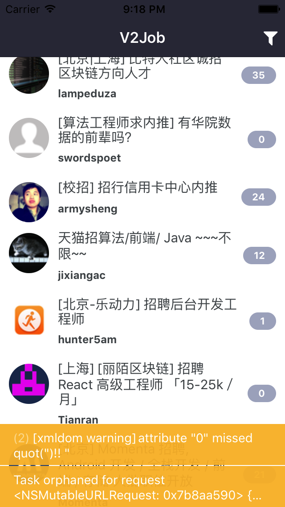
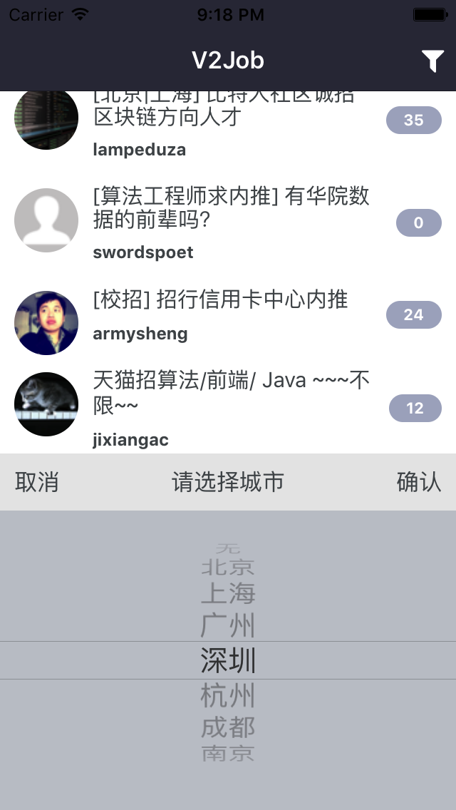
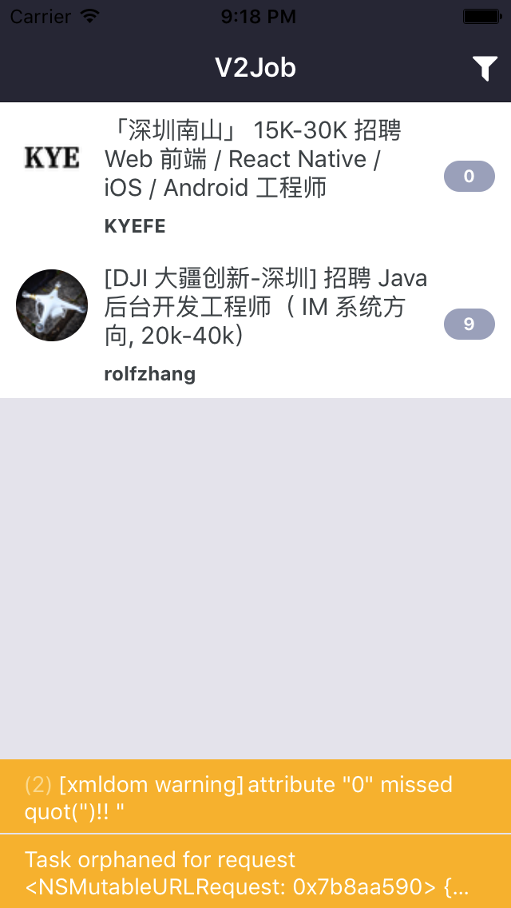
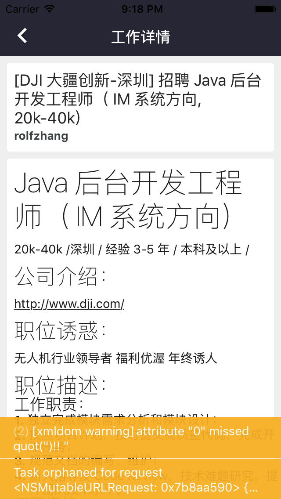

# V2Job
V2EX [酷工作] 板块查看工具 - Powered By ReactNative

### Screenshots

|             |                    |                             |                                         |
| ------------ | ------------------ | --------------------------- | ----------------------------------------|
|  |    |  | |

### Quick Start
- Clone repo
- `cd V2Job`
- `npm install` or `yarn install`
- `react-native run-ios`

### Road Map
- [x] Parse job list from V2EX webpage.
- [x] Cell image cache.
- [x] Filter by city name with picker view.
- [x] Navigation (Using React-Navigation)
- [x] Fetch and render markdown format job detail from V2EX API.
- [ ] Dynamically change navbar right button's function according to different display mode.
- [ ] Build for Production Scheme.
- [ ] Submit to AppStore.

### Known Issues
- App would crash when markdown renderer trying to load unspported characters.
The error on the screen like this: `View within TextView must has height and width`

- Build App with Xcode8.3 for production failed on all device.
- Run App on iPhone6s/10.3.3 failed while iPhone5s is OK.
